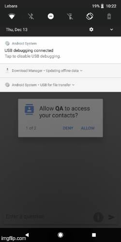

QAMEL (Question Answering on Mobile Devices) is a mobile application that is able to answer the user's typed and spoken questions in offline mode i.e., without a  connection to a powerful server and also in online mode. Here is the demo video with the features of the mobile application

Evaluation
For the offline QA evaluation, we used SimpleDbpeidaQA dataset. The results are presented
in Table.
